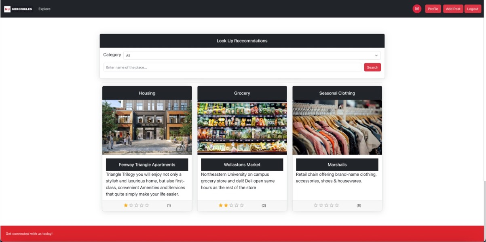
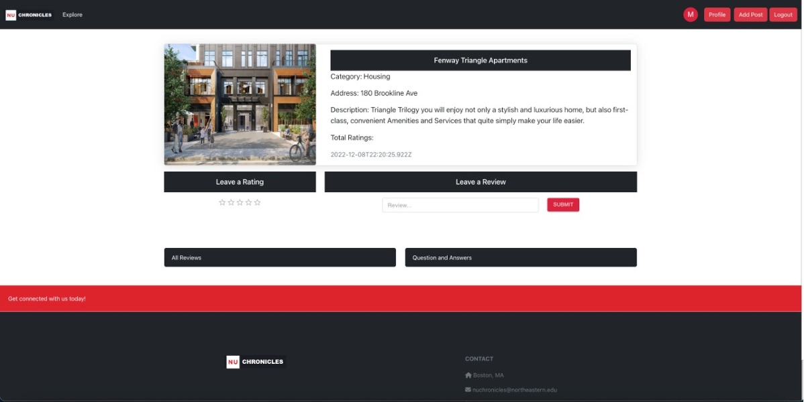
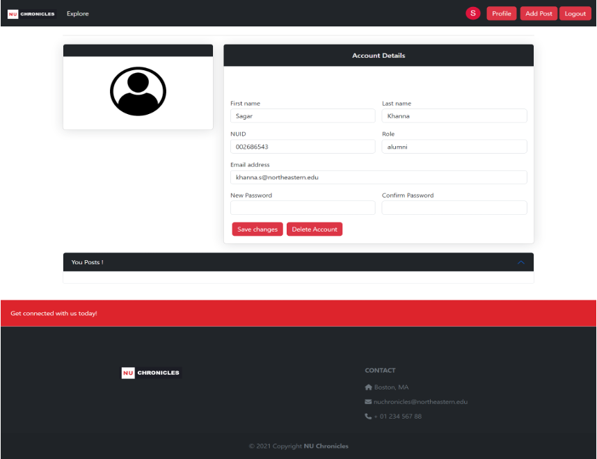
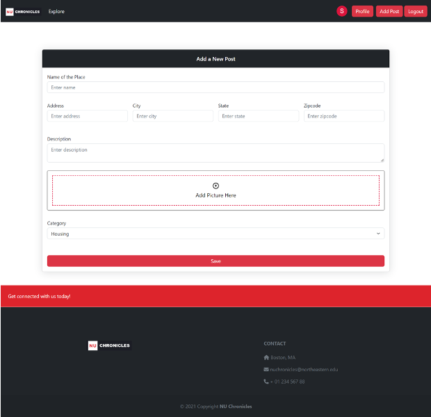
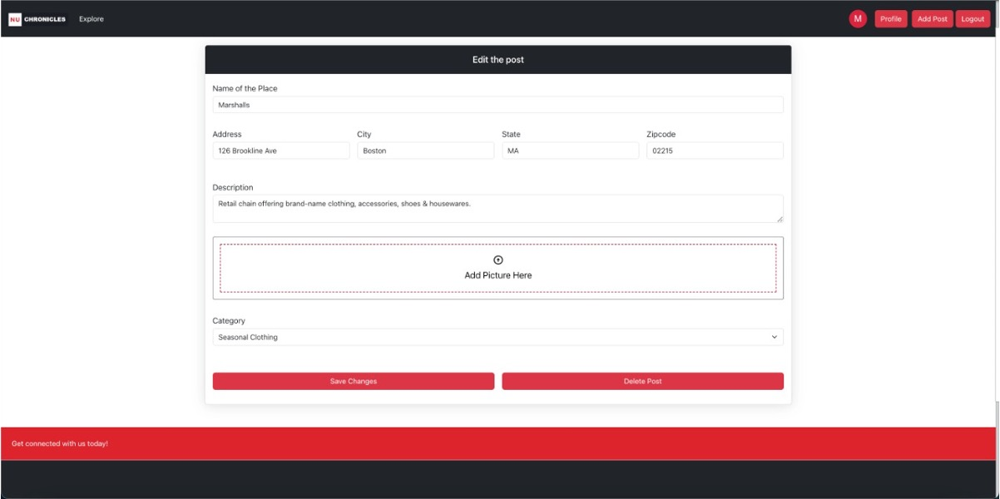

# NU Chronicales

INFO6150 - Web Design and User Experience Engineering - Course Project

Website’s Purpose:
Our website serves as a one-stop solution for all new international students coming to NEU. It provides students with a list of the best economical options for accommodation, grocery stores, seasonal shopping, places to eat, and among other things that have been verified and reviewed by current NEU students and alumnus,  so assisting them while also protecting them.

<h5> Website Screenshots </h5>

